# Diagramas de Fluxos e Classes

## 1. Visao Geral

Este documento apresenta diagramas baseados no Documento de Requisitos de Software, Historias de Usuario e Casos de Uso do ConvNetJS.

Os diagramas usam sintaxe Mermaid para facilitar visualizacao em ferramentas compativeis com Markdown.

## 2. Diagrama Geral de Casos de Uso

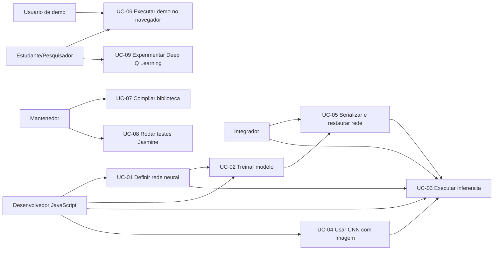

## 3. Fluxo UC-01 - Definir Rede Neural

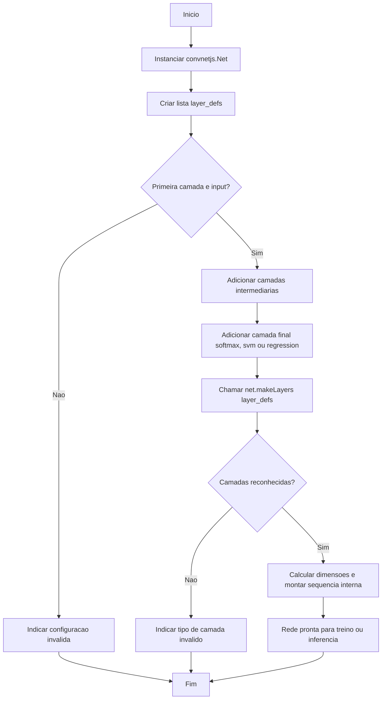

## 4. Fluxo UC-02 - Treinar Modelo

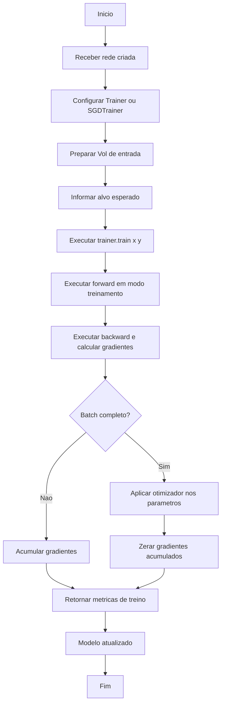

## 5. Fluxo UC-03 - Executar Inferencia

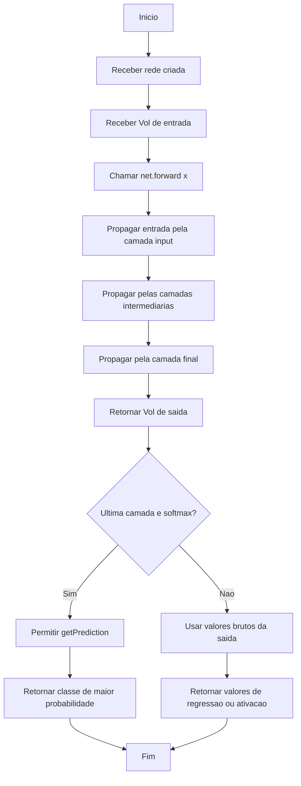

## 6. Fluxo UC-04 - Usar CNN com Imagem

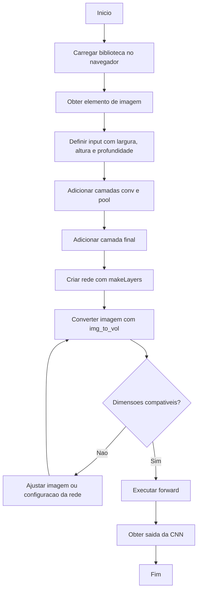

## 7. Fluxo UC-05 - Serializar e Restaurar Rede

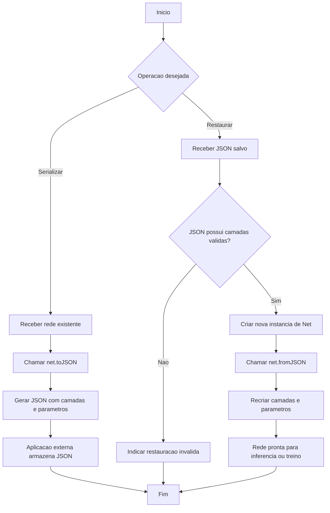

## 8. Fluxo UC-06 - Executar Demo no Navegador

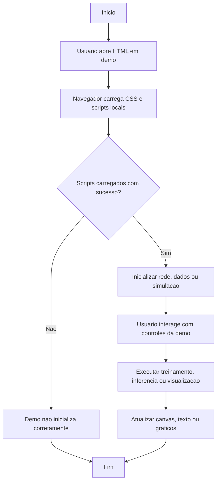

## 9. Fluxo UC-07 - Compilar Biblioteca

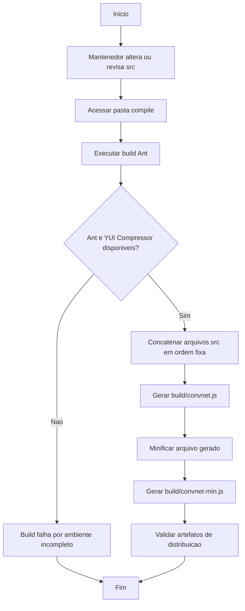

## 10. Fluxo UC-08 - Rodar Testes Jasmine

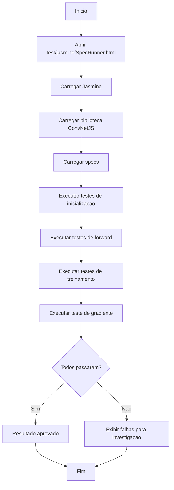

## 11. Fluxo UC-09 - Experimentar Deep Q Learning

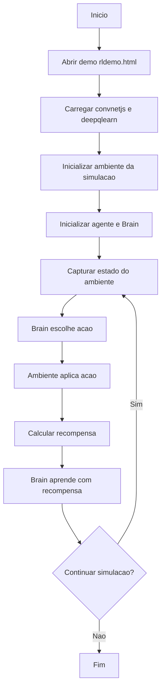

## 12. Diagrama de Classes Conceitual

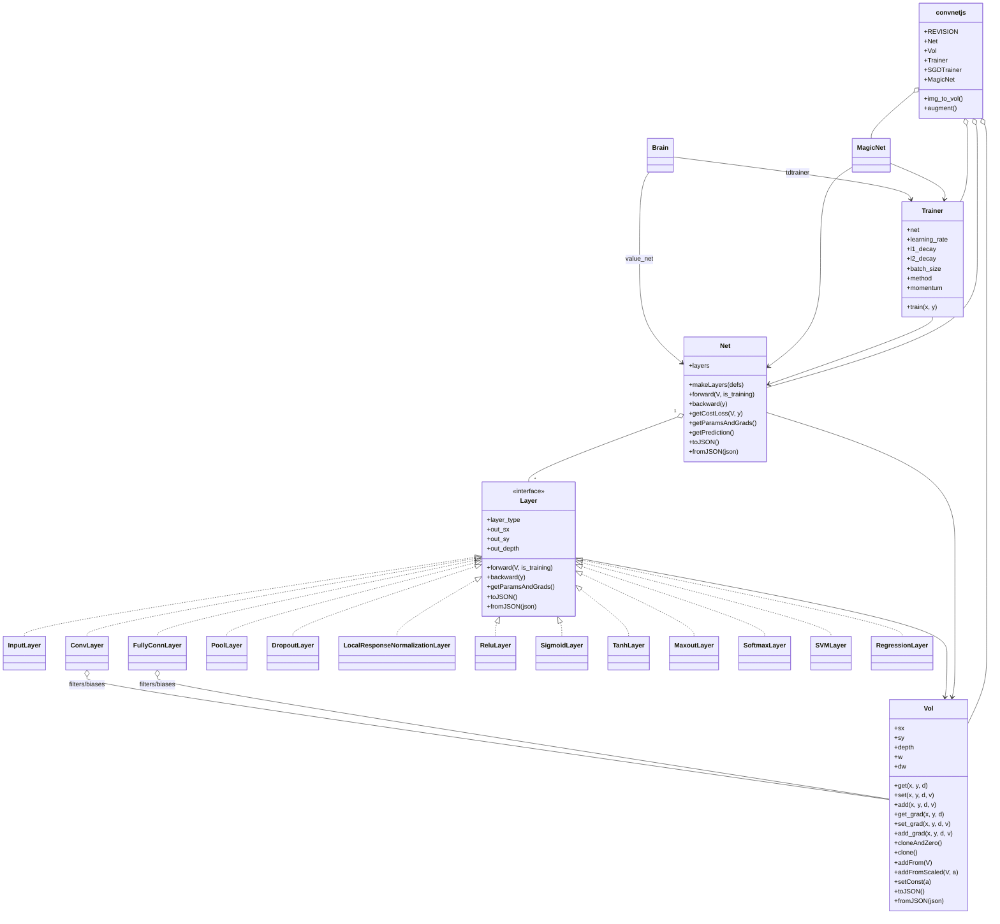

## 13. Diagrama de Componentes

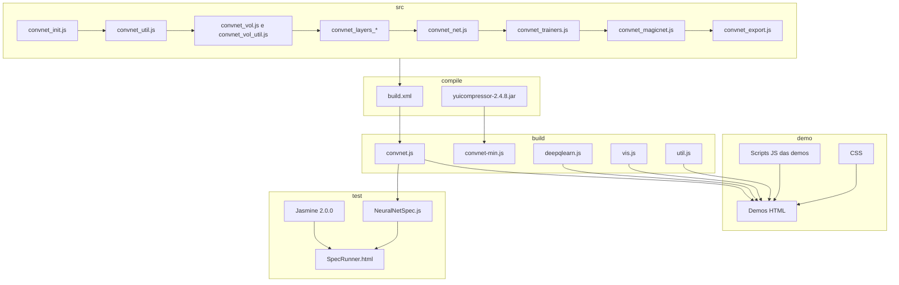

## 14. Rastreabilidade dos Diagramas

| Diagrama | Base documental | Requisitos/casos relacionados |
| --- | --- | --- |
| Diagrama geral de casos de uso | Casos de Uso e Historias de Usuario | UC-01 a UC-09, HU-01 a HU-12 |
| Fluxo de definicao de rede | Documento de Requisitos e UC-01 | RF-01, RF-02, RF-03 a RF-08 |
| Fluxo de treinamento | UC-02 | RF-10, RF-11 |
| Fluxo de inferencia | UC-03 | RF-09, RF-12, RF-14 |
| Fluxo de CNN com imagem | UC-04 | RF-04, RF-05, RF-15 |
| Fluxo de serializacao | UC-05 | RF-13 |
| Fluxo de demo | UC-06 | RF-18, RNF-05 |
| Fluxo de build | UC-07 | RF-19, RNF-04 |
| Fluxo de testes | UC-08 | RF-20, RNF-07 |
| Fluxo de Deep Q Learning | UC-09 | RF-21 |
| Diagrama de classes | Requisitos, README e `src/` | RF-01 a RF-17 |
| Diagrama de componentes | Plano de Refatoracao e estrutura do repositorio | RF-16 a RF-20 |

